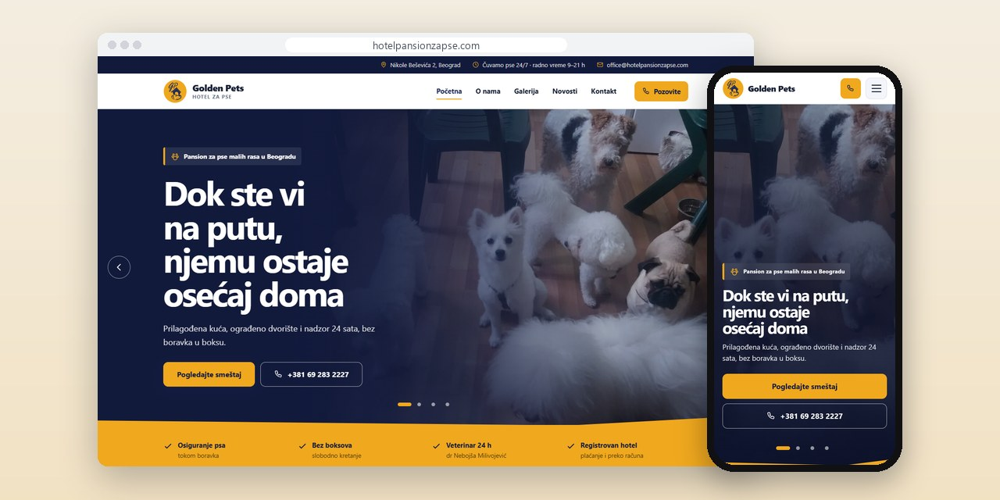
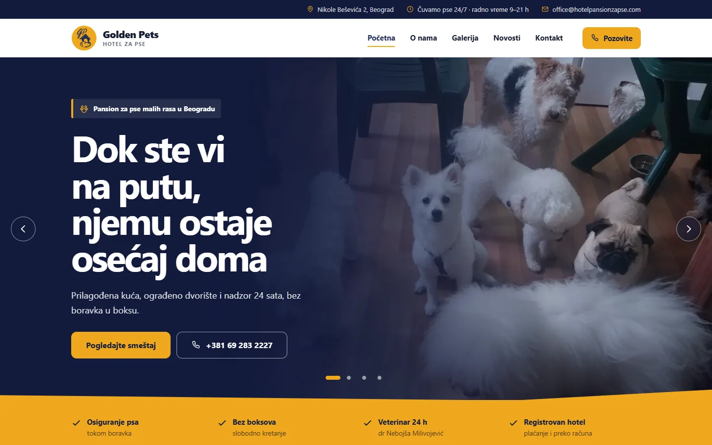
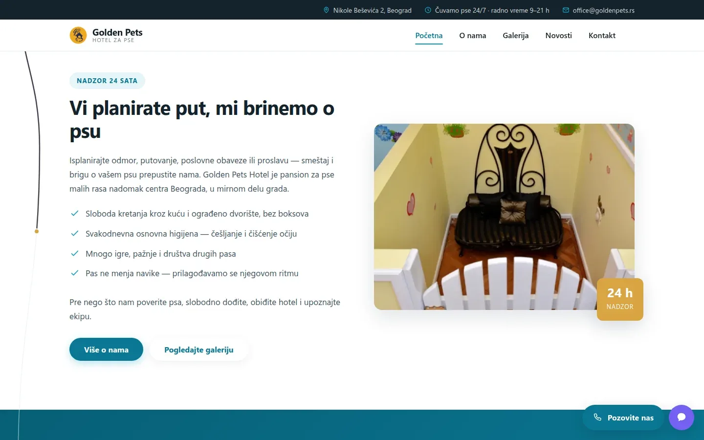
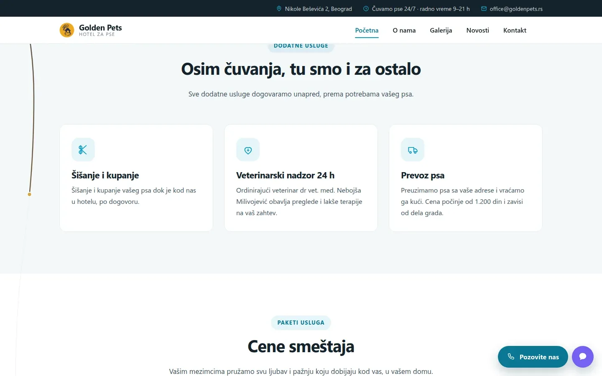

# Golden Pets Hotel

New site for a Belgrade boarding house for small dogs, moved off a 2019 WordPress install with a plan for each of its 139 old URLs.

**[hotelpansionzapse.com](https://www.hotelpansionzapse.com/)** · [Case study (in Serbian)](https://svilenkovic.com/radovi/golden-pets-hotel) · [Srpski](README.sr.md)

> [!NOTE]
> Client project. The source code belongs to the client and stays in a private repository. This page describes what I built and how.

<table>
  <tr><td><b>Client</b></td><td>Golden Pets Hotel</td></tr>
  <tr><td><b>Industry</b></td><td>Boarding for small dog breeds</td></tr>
  <tr><td><b>Location</b></td><td>Belgrade, Serbia</td></tr>
  <tr><td><b>Type</b></td><td>Multi-page website</td></tr>
  <tr><td><b>My role</b></td><td>Redesign, development, migration, hosting and maintenance</td></tr>
  <tr><td><b>Stack</b></td><td>PHP 8.3, nginx, WebP, JSON-LD</td></tr>
</table>

## About the project

Golden Pets Hotel boards dogs of up to 15 kg in a house with a fenced yard instead of kennels, with someone watching them around the clock. The old site was a WordPress install frozen in 2019 and laid out with a page builder that had been withdrawn over a security hole, so it could not be updated at all. The owner wanted no online booking: people should call, because the staff ask about the dog before confirming anything. A short inquiry form for the breed and dates came later.

Search engines knew 139 addresses of the old site, and that history was the one thing a relaunch could wipe out in a day. The main pages kept their old paths, 82 old URLs were redirected through a map on the server, and 76 leftovers, such as demo shop products and an empty language branch, now return 410 instead of being pushed to the homepage. After the switch I checked every one of them on the live domain.

## What I built

- A homepage and four pages (about, gallery, news, contact), with prices, hours and contact details kept in one data file
- Phone links fixed after it turned out that every `tel:` link dialled the number without its last digit
- A price section with three packages and a discount note, where each package now shows its own price unit
- A gallery of 16 of the 28 photos the client sent, each with a dog in it, about 210 KB for the whole grid
- Nothing requested from other servers: no analytics, pixels, embedded maps or external fonts, and so no consent banner
- The domain and the mailbox moved as well, several hundred messages included, without the client changing a password

## Results

| | Performance | Accessibility | Best practices | SEO |
| :-- | :-: | :-: | :-: | :-: |
| Mobile | 100 | 100 | 100 | 100 |
| Desktop | 100 | 100 | 100 | 100 |

PageSpeed Insights, lab test of the live site, September 2026. Security headers: 6 of 6. HTML validator: no errors. axe accessibility check: no violations. Structured data: `LocalBusiness`.

## Screenshots

<table>
  <tr>
    <td width="68%" valign="top"></td>
    <td width="32%" valign="top"></td>
  </tr>
</table>

"Vi planirate put, mi brinemo o psu" (You plan the trip, we look after the dog), with an invitation to visit

Extra services, right above the price list

---

Built by [D. Svilenković](https://svilenkovic.com).
